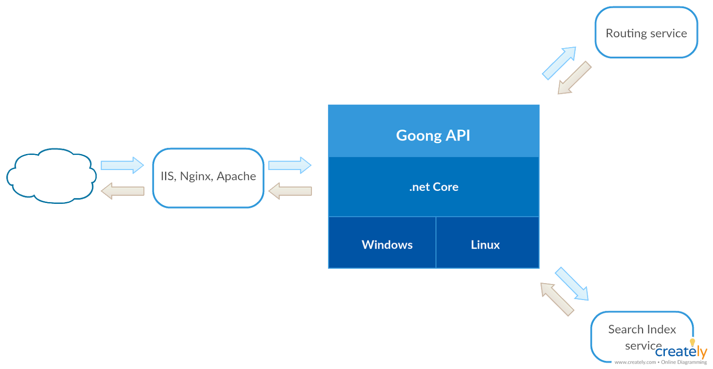
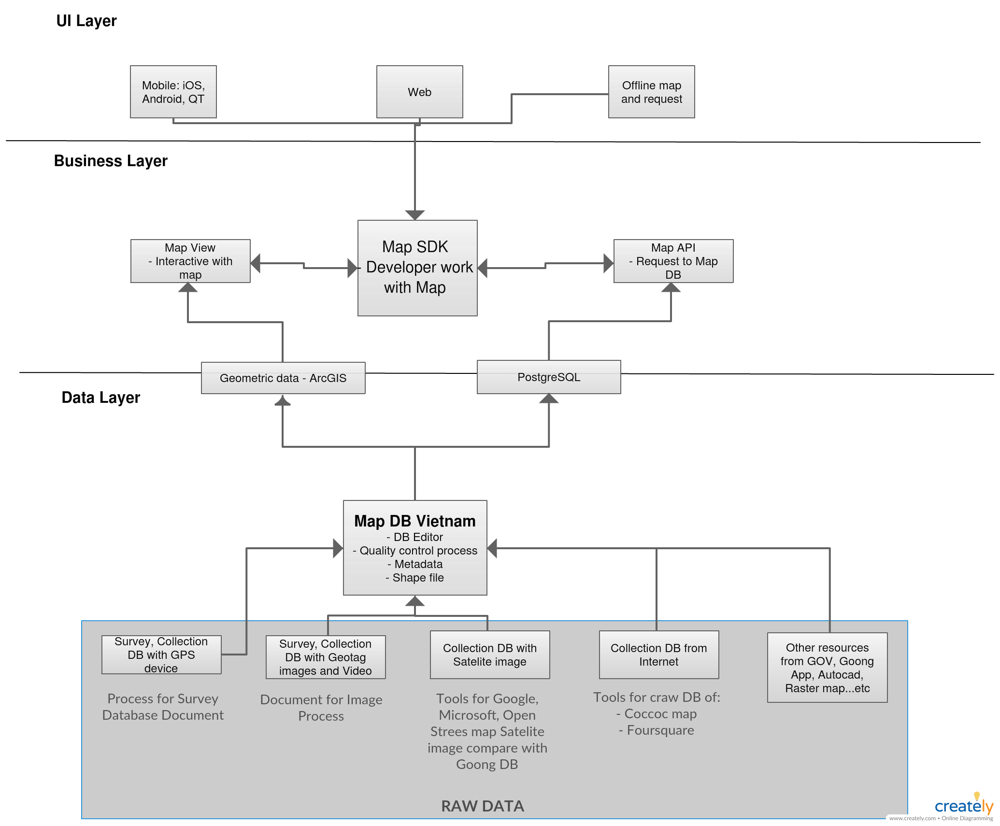

# Goong System Architecture

## Goong API system architecture

Kiến trúc hệ thống của Goong API gồm các thành phần chính sau:
- Reverse Proxy: sử dụng IIS, NGINX và Apache, có nhiệm vụ tiếp nhận các request truyền đến và chuyển tiếp các request đó đến *Goong Core API*. Thành phần này sẽ làm tăng tính bảo mật do thông tin các service đứng sau sẽ không được public ra bên ngoài. Ngoài ra các tác vụ như authentication, request caching, request logging, request compressing. Ngoài ra reverse proxy sẽ giúp việc scale hệ thống dễ dàng hơn thông qua việc sử dụng Load Balancing.
- Goong Core API: xây dựng trên nền tảng .NET, sử dụng Kestrel webserver cho việc tiếp nhận và xử lý các request từ reverse proxy.
- Routing service: thực hiện các tác vụ như tìm đường ngắn nhất giữa 2 cặp toạ độ.
- Searching service: thực hiện các tác vụ như geocoding, reverse geocoding, autocomple search, lấy chi tiết của một place nào đó.

Goong REST API reference: https://docs.goong.io/rest/guide

## Goong system components

Cấu trúc hệ thống của Goong được chia thành 3 tầng chính sau:
- Tầng dữ liệu (Data layer)
- Tầng nghiệp vụ (Business layer)
- Tầng giao diện người dùng (UI layer)

### Tầng dữ liệu
Tầng này có nhiệm vụ xây dựng kho cơ sở dữ liệu bản đồ cho Goong. Goong thu thập dữ liệu bản đồ qua khá nhiều nguồn khác nhau. Trong đó có hai nguồn dữ liệu chính sau:
- Các điểm POIs
- Dữ liệu đường phố

Các điểm POIs (ngân hàng, trạm y tế, trạm xăng, trạm sửa xe,...) sẽ được thu thập bằng các phương pháp sau:
- Thực hiện các bài khảo sát sử dụng các thiết bị có chức năng GPS như smart phone. Trong đó bài khảo sát sẽ yêu cầu người sử dụng cung cấp các thông tin liên quan đến một tọa độ lat/lon nào đó. Phương pháp này đòi hỏi sự ủng hộ và đóng góp từ phía người dùng. Một số công cụ survey điển hình: [Survey123 for ArcGIS](https://survey123.arcgis.com)
- Tạo crawlers và crawl dữ liệu từ các dịch vụ bản đồ khác như: [Coccoc Map](https://map.coccoc.com), [Foursquare](https://foursquare.com)
- Thu thập từ các nguồn khác như GOV, từ mobile app của Goong, Autocad,...

Các dữ liệu đường phố sẽ được thu thập bằng các phương pháp sau:
- Thực hiện các bài khảo sát tương tự như POIs. Dữ liệu của các bài khảo sát có thể ở dạng hình ảnh hoặc video. Dữ liệu đó sau đó có thể được dùng làm input cho các thuật toán machine learning để giải quyết các bài toán như: xác định đèn báo hiệu giao thông, xác định đường cấm đường một chiều thông qua các biển báo giao thông,...
- Sử dụng các dữ liệu hình ảnh từ vệ tinh (từ Google, OpenStreetMap, Microsoft) để làm giàu và bổ sung dữ liệu cho Goong.

Dữ liệu từ các bước thu thập trên sẽ là các shapefiles và các thông tin metadata. Dữ liệu này sẽ được dùng để:
- Lưu trữ trong hệ cơ sở dữ liệu quan hệ PostgreSQL phụ vụ cho việc searching các dữ liệu liên quan đến địa điểm đường phố, các điểm POIs,...
- Dùng như dữ liệu đầu vào cho các phần mềm như ArcGIS. ArcGIS là một bộ phần mềm ứng dụng bao gồm ArcMap, ArcCatalog, ArcToolbox, ModelBuilder, ArcScene và ArcGlobe dùng để giải quyết các bài toán ứng dụng GIS như thành lập bản đồ, phân tích địa lý, chỉnh sửa và biên tập dữ liệu bản đồ,...

### Tầng nghiệp vụ
Tầng này cung cấp các giao diện ứng dụng (application interface) để các bên thứ 3 có thể sử dụng Goong để tích hợp vào ứng dụng của họ.

Tầng này gồm 3 phần chính sau:
- Goong REST API: cung cấp một số API endpoints để thực hiện các việc liên quan đến searching và routing. Người dùng sẽ phải trả phí để sử dụng các API này. Reference: https://docs.goong.io/rest/guide
- Map SDK cho các môi trường như web, mobile application (Android and iOS). [Goong JavaScript SDK](https://docs.goong.io/js/guide), [Goong Android SDK](https://docs.goong.io/android/guide), [Goong iOS SDK](https://docs.goong.io/ios/guide).
- Map View: cho phép thao các với các thành phần trên bản đồ, như zoom, pan, street view,...

### Tần giao diện người dùng
Tâng này chủ yếu là hệ sinh thái mà Goong xây dựng trên nền của tầng nghiệp vụ, bao gồm
- Goong Live Map - https://maps.goong.io
- Goong Android và iOS apps

## Goong and OSM
