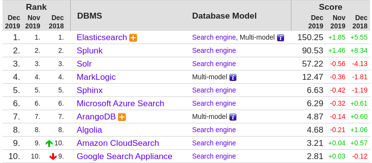
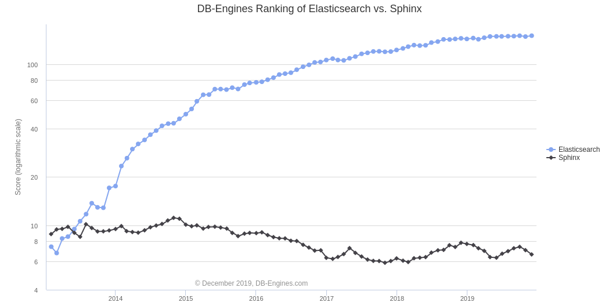

# **Sphinx** search

## Giới thiệu chung

**Sphinx** là một gói phần mềm độc lập cung cấp chức năng tìm kiếm toàn bộ văn bản với tốc độ nhanh, hỗ trợ full-text search. **Sphinx** được dùng cho các hệ thống nổi tiếng như Joomla.org, CouchSurfing.org, Wikimapia.org, Tumblr.com và *hàng* trăm ứng dụng khác. Hiện tại **Sphinx** đứng thứ **5** trong [bảng xếp hạng DB search engines](https://db-engines.com/en/ranking/search+engine)

## Ý tưởng chủ đạo

Mọi project đều tạo ra một từ điển riêng, **Sphinx** cũng vậy. Tuy nhiên các khái niệm mới chủ yếu dựa trên cấu trúc database, gần gũi với SQL và chũng không có quá nhiều. Dưới đây là từ điển của **Sphinx**

|Khái niệm của Sphinx| Khái niệm sát với SQL nhất|
|-|-|
|Index|Table|
|Document|Row|
|Field or attribute|Column và / hoặc một FULLTEXT index|
|Indexed field|Một FULLTEXT index trên một column văn bản|
|Stored field|Column văn bản và một FULLTEXT index trên nó|
|Attribute|Column|
|MVA|Column loại INT_SET |
|JSON attribute|Column loại JSON|
|Attribute index|Index|
|Document ID, docid|Column có tên “id” loại BIGINT |
|Row ID, rowid|Số thứ tự row của riêng Sphinx|

### Index (chỉ mục)

*Chỉ mục* (index) là *bộ sưu tập* (collection) các *tài liệu* (document) bán cấu trúc. Chúng có vẻ gần với các *bảng* (table) SQL hơn so với các *bộ sưu tập* (collection) Mongo, nhưng trong cốt lõi của chúng, chúng thực sự không có cấu trúc. Cấu trúc dữ liệu cơ bản là một *chỉ mục toàn văn* (full-text-index). Đó là một cấu trúc đặc biệt cho phép **Sphinx** phản hồi rất nhanh đối với một truy vấn như "cung cấp cho tôi các định danh của tất cả tài liệu đề cập đến từ khóa này hoặc từ khóa kia". Hoặc bất cứ thứ gì khác (bất kỳ thuộc tính bổ sung hoặc kho lưu trữ tài liệu hoặc thậm chí ngôn ngữ SQL hoặc HTTP, v.v...) mà **Sphinx** cung cấp về cơ bản là một loại bổ sung trên cấu trúc dữ liệu cơ sở đó.

Schema-wise, chỉ mục cố gắng kết hợp những điểm tốt nhất của schemaful và schemaless. Đối với các *cột* (column) định nghĩa kiểu trước, có thể sử dụng các thuộc tính được nhập tĩnh và nhận được hiệu quả tuyệt đối. Đối với dữ liệu động hơn, có thể đặt tất cả vào một thuộc tính JSON và vẫn có hiệu suất khá tốt.

Vì vậy, theo một nghĩa nào đó, **Sphinx indexes == SQL tables**, ngoại trừ:
- Tìm kiếm toàn văn bản rất nhanh và đi kèm với rất nhiều tùy chọn điều chỉnh cụ thể tìm kiếm toàn văn bản. - Các thuộc tính JSON được hỗ trợ khá hữu ích, vì vậy bạn có thể sử dụng schemaless.
- Về các trường được lập chỉ mục toàn văn bản, bạn có thể chọn chỉ lưu trữ chỉ mục toàn văn bản và bỏ các giá trị gốc.

### Document (tài liệu)

Về cơ bản, các *tài liệu* chỉ là một danh sách các *trường* (field) được đặt tên, và các *thuộc tính* (attribute) có loại bất kỳ. Nó giống với các *hàng* (row) của SQL.

Kể từ phiên bản 3.0.1, **Sphinx** vẫn yêu cầu một thuộc tính id duy nhất và ngầm định chèn một cột BIGINT vào các chỉ mục. **Sphinx** vẫn sử dụng *docids* để xác định các *hàng* khi gọi các câu lệnh như DELETE chẳng hạn. Tuy nhiên, không giống như trong phiên bản 2.x, **Sphinx** không còn sử dụng *docids* để xác định tài liệu bên trong. Vì vậy, 0 và *docids* âm đã được cho phép.

### Field (trường)

Các *trường* là các văn bản mà **Sphinx** lập chỉ mục và làm cho từ khóa có thể tìm kiếm được. Chúng luôn được lập chỉ mục, cũng như được lập chỉ mục toàn văn. Nội dung gốc không được lập chỉ mục của chúng cũng có thể được lưu trữ vào chỉ mục để truy xuất sau này. Theo mặc định, chúng được đánh chỉ mục và **Sphinx** sẽ chỉ trả về các thuộc tính chứ không phải nội dung. Đánh chỉ mục với một cờ được lưu trữ trong lệnh CREATE TABLE hoặc trong tệp cấu hình ETL bằng archive_fields, cũng có thể nạp luôn khi INSERT.

Nội dung các *trường* đã lưu trữ được lưu trong một chỉ mục đặc biệt gọi là kho lưu trữ tài liệu, viết tắt là DocStore.

### Attribute (thuộc tính)

**Sphinx** hỗ trợ các kiểu dữ liệu sau:

|Kiểu dữ liệu|Khoảng giá trị|
|-|-|
|INTEGER|0 -> 2^32-1|
|BIGINT|-2^63 -> 2^63-1|
|FLOAT|32-bit độ chính xác 1 chữ số thập phân|
|BOOL|true / false|
|STRING| Chuỗi văn bản|
|JSON| Tài liệu JSON|
|MVA|Thuộc tính đa giá trị, tập hợp các INTEGER không trùng nhau|
|MVA64|Thuộc tính đa giá trị, tập hợp các BIGINT không trùng nhau|

**Sphinx** phát hiện ra rằng các *thẻ* (tag) của mảng chỉ bao gồm các số nguyên, và lưu trữ dữ liệu mảng sử dụng chính xác 24 byte, chỉ sử dụng 4 byte cho mỗi 6 giá trị. Tất nhiên, vẫn còn các chi phí lưu trữ các khóa JSON và cấu trúc tài liệu chung, vì vậy toàn bộ tài liệu sẽ mất nhiều hơn thế. Tuy nhiên, khi nói đến việc lưu trữ dữ liệu *hàng* loạt vào chỉ mục **Sphinx** để sử dụng sau này, chỉ cần cung cấp một mảng JSON được nhập liên tục và dữ liệu đó sẽ được lưu trữ - và được xử lý - với hiệu quả tối đa.

Các thuộc tính được cho là phù hợp với RAM và **Sphinx** được tối ưu hóa cho trường hợp đó. Tất nhiên, lý tưởng nhất là tất cả dữ liệu chỉ mục của bạn phải phù hợp với RAM, trong khi được hỗ trợ bởi ổ SSD đủ nhanh để duy trì.

Bây giờ, có các thuộc tính chiều rộng cố định và chiều rộng thay đổi trong số các loại được hỗ trợ. Đương nhiên, INTEGER và FLOAT sẽ luôn chiếm chính xác 4 byte, trong khi các kiểu STRING và JSON có thể ngắn như, dài, rỗng; hoặc miễn là vài megabyte. Tại sao không lưu mọi thứ dưới dạng JSON?

Câu trả lời là hiệu suất. Trong **Sphinx** có hai kho riêng biệt cho các phần của hàng. Các thuộc tính độ rộng cố định, bao gồm các thuộc tính hệ thống ẩn, về cơ bản được lưu trữ trong ma trận NxM lớn, trong đó N là số lượng *hàng* và M là số thuộc tính chiều rộng cố định. Bất kỳ truy cập nào cũng rất nhanh chóng. Tất cả các thuộc tính chiều rộng thay đổi cho một *hàng* được nhóm lại với nhau và được lưu trữ trong một bộ lưu trữ riêng biệt. Do đó, việc truy cập một chuỗi hoặc JSON hoặc giá trị MVA, không tính khóa JSON, có phần phức tạp hơn. Tối ưu hóa được thực hiện trên mỗi bước bên trong, tuy nhiên, nếu truy cập nhiều giá trị sẽ có tác động hiệu suất. Ngoài ra, khóa càng sâu vào JSON đó thì càng tệ. Ví dụ: sử dụng một thử nghiệm nhỏ với 1.000.000 *hàng* và chỉ 4 thuộc tính số nguyên cộng với chính xác 4 giá trị được lưu trữ trong JSON, đo đạc sẽ mang lại kết quả như sau:

|Thuộc tính | Thời gian (giây) | Số lần chậm đi|
|-|-|-|
|Số nguyên bất kỳ|0.032|-|
|khóa JSON thứ nhất|0.045|~1.4|
|khóa JSON thứ hai|0.052|~1.6|
|khóa JSON thứ ba|0.059|~1.8|
|khóa JSON thứ tư|0.065|~2.0|

Và với nhiều thuộc tính hơn thì còn chậm hơn nữa. Nếu có nhiều dữ liệu, chúng ta nên xác định một số cột hay truy vấn nhất và lưu trữ chúng dưới dạng các cột có kiểu dữ liệu thông thường, giúp phần nào cải thiện hiệu suất.

## Ưu điểm

### Tìm kiếm nhanh và đầy sức mạnh

**Sphinx** đã được phát triển trong những năm gần đầy, và đã trở thành một công cụ tìm kiếm gần đạt thời gian thực. Nó đã đạt tốc độ hơn **500 truy vấn một giây** cho **1 triệu** tài liệu, với số lượng đăng ký index lớn nhất là đạt **25 tỷ** tài liệu.

Với sự trợ giúp của **Sphinx**, Craigslist đã phục vụ hơn **300 triệu truy vấn mỗi ngày**. Nhiều hơn **50 tỷ** trang mỗi tháng.

Infegy sử dụng **Sphinx** để index **22 tỷ** bài post Twitter, Facebook và các trang blog khác, để phục vụ cho khả năng giám sát phương tiện truyền thông xã hội và phân tích truy vấn.

### Faceted search

**Sphinx** có một trải nghiệm tuyệt vời với [faceted search](https://en.wikipedia.org/wiki/Faceted_search)

Trang video lớn nhất của trung quốc, Youku Tudou, sử dụng **Sphinx** để faceted search cho các nội dung, được phân bố cho **400 triệu người dùng mỗi tháng**, với đỉnh điểm khối lượng sử dụng đạt **15,000 truy vấn mỗi giây**.

Greenice gần đây cũng sử dụng **Sphinx** cho các cửa *hàng* kinh doanh phần cứng máy tính. Faceted search được sử dụng với các thuộc tính như nhãn hàng, loại, mục đích dùng, độ phân giải màn hình, dung lượng HDD, dung lượng SSD, ...

### Phù hợp với ứng dụng tìm kiếm thông thường

Nếu chúng ta cần các chức năng tìm kiếm thông thường, và không cần các tính năng bổ sung như trực quan hoá dữ liệu và phân tích, hãy sử dụng Sphinx. Nó khá nhanh và đầy sức mạnh cho khả năng index và truy vấn một khối lượng lớn các tài liệu mả chỉ sử dụng giới hạn nguồn tài nguyên máy tính, không giống như Elasticsearch, tiêu thụ khá nhiều bộ nhớ.

Một trong những ví dụ đó là Boardreader, **Sphinx** có thể index tới 16 tỷ tài liệu thông qua 37 thiết bị.

## Nhược điểm

**Sphinx** rất tốt cho các dữ liệu có cấu trúc ( đinh nghĩa các trường text và các thuộc tính không phải là text ), nhưng nó không phải là sự lựa chọn tốt nhất cho các dự án mà cần xử lý các dữ liệu không cấu trúc ( DOC, PDF, MP3, ... ), khi đó chúng ta sẽ cần phải tốn khá nhiều thời gian để cấu hình.

## Kết nối với database 

**Sphinx** được thiết kế đặc biệt để tích hợp tốt với các cơ sở dữ liệu SQL, cũng như có thể dễ dàng truy cập bằng scripting languages. Tuy nhiên, **Sphinx** không phụ thuộc và cũng không yêu cầu bất kỳ database cụ thể nào để hoạt động.

Lập trình viên có thể truy cập vào **Sphinx** daemon (searchd) bằng cách sử dụng một trong ba phương pháp khác nhau để truy cập:

- Qua MySQL network protocol (sử dụng một ngôn ngữ có tên là SphinxQL)
- Thông qua API tìm kiếm bản địa (SphinxAPI)
- Thông qua máy chủ MySQL với pluggable storage engine (SphinxSE)

## So sánh với Elastic Search

### Giới thiệu qua về Elastic Search
Là giải pháp tìm kiếm đứng đầu trong năm 2018, đúng với cái tên của nó elastic, có khả năng hoạt động tốt trên nhiều môi trường. Nó là công nghệ mã nguồn mở và sử dụng thư viện Apache Lucene.

Nhiều công ty trên thế giới sử dụng Elastic cho ứng dụng. Có thể kể đến: TripAdvisor, Shopify, Mozilla, Foursquare, Etsy, Github, SoundCloud, eBay, Yelp, và Netflix, và nhiều ứng dụng khác.

### So sánh tính chất hệ thống

|Tên |  Sphinx |Elastic search|
|-|-|-|
| Mô tả| Công cụ tìm kiếm mã nguồn mở phục vụ tìm kiếm dữ liệu từ nhiều nguồn| Công cụ tìm kiếm và phân tích hiện đại, sử dụng RESTful|
| Mô hình cơ sở dữ liệu chính| [Công cụ tìm kiếm](https://db-engines.com/en/article/Search+Engines)| [Công cụ tìm kiếm](https://db-engines.com/en/article/Search+Engines)|
| Mô hình cơ sở dữ liệu thứ cấp| | [Kho tài liệu](https://db-engines.com/en/article/Document+Stores)|
| Xếp hạng công cụ tìm kiếm cơ sở dữ liệu| Điểm: **6.63**.  Hạng **#50** tổng quan và **#5** công cụ tìm kiếm| Điểm: **150.25** . Hạng **#7** tổng quan và **#1** công cụ tìm kiếm|
| Giấy phép|GPL version 2, commercial licence available|Apache Version 2; Elastic License | 
|Nhà phát triển|Sphinx Technologies Inc.|Elastic|
|Năm ra mắt|2001|2010|
|Phiên bản mới nhất|3.1.1, tháng 10 năm 2018|7.3.0, tháng 8 năm 2019|
| Cơ sở dữ liệu như một dịch vụ| | [Elasticsearch Service on Elastic Cloud](https://info.elastic.co/elasticsearch-service-trial-db-engines.html?blade=db-engines-rltdprdcts)|
| Ngôn ngữ cài đặt|C++ |Java |
| Hệ thống vận hành|FreeBSD, Linux, NetBSD, OS X, Solaris, Windows | Tất cả hệ thống có Java VM|
| Lược đồ dữ liệu| Có | Tự do (định nghĩa linh hoạt. Khi một kiểu được định nghĩa, nó sẽ tồn tại)|
| Định nghĩa trước kiểu dữ liệu|Không |Có |
| Chỉ mục thứ cấp| Có| Có|
| Hỗ trợ SQL| ngôn ngữ truy vấn giống SQL (SphinxQL)|ngôn ngữ truy vấn giống SQL |
| APIs và phương thức truy cập khác|Giao thức độc quyền | Java API và RESTful HTTP/JSON API|
| Ngôn ngữ lập trình được hỗ trợ|C++(thư viện máy khách không chính thức) / Java / Perl(thư viện máy khách không chính thức) / PHP / Python / Ruby(thư viện máy khách không chính thức) |.Net / Groovy / Java / JavaScript / Perl / PHP / Python / Ruby / [Cộng đồng đóng góp](https://www.elastic.co/guide/en/elasticsearch/client/community/current/index.html) |
| Stored procedures|Không | Có|
| Triggers| Không| Có (sử dụng tính năng 'percolation')|
| Phương thức lưu trữ dữ liệu khác nhau trên các nốt khác nhau|Sharding (Phân vùng được thực hiện thủ công, các truy vấn tìm kiếm theo chỉ mục phân tán được hỗ trợ)| Sharding|
| Phương thức lưu trữ dữ liệu dư thừa trên nhiều nốt| Không| Có|
| Cung cấp API cho các phương thức Map / Reduce do người dùng xác định|Không | ES-Hadoop Connector|
|Các phương pháp để đảm bảo tính nhất quán trong một hệ thống phân tán | | Eventual Consistency (Đồng bộ tài liệu bằng nhân bản. *Get by ID* có thể trễ tối đa 1s. )|
| Khóa ngoại| Không |Không |
| Transaction (toàn vẹn giao dịch)| Không| Không|
| Hỗ trợ thao tác đồng thời cho dữ liệu| Có |Có |
| Hỗ trợ làm cho dữ liệu liên tục| Có (nội dung ban đầu của các trường không được lưu trữ trong chỉ mục)|Có |
| Có một tùy chọn để xác định một số hoặc tất cả các cấu trúc chỉ được giữ trong bộ nhớ| |Tích hợp [Memcached](https://db-engines.com/en/system/Memcached) và [Redis](https://db-engines.com/en/system/Redis) |
| Kiểm soát truy cập| Không| |
| Lợi thế cạnh tranh| | Open source, real-time index, search and analysis, horizontally scalable, distributed, resilient|
| Các kịch bản ứng dụng điển hình| | Các trường hợp sử dụng tìm kiếm, ghi nhật ký, bảo mật, số liệu và phân tích.|
| Khách *hàng* chủ chốt| |Cisco, eBay, Goldman Sachs, NASA, Microsoft, Mayo Clinic, New York Times, Wikipedia và Verizon sử dụng ES để cung cấp năng lượng cho các hệ thống quan trọng. |
| Số liệu thị trường| | Hơn 250 triệu lượt tải xuống. Hơn 100.000 thành viên cộng đồng ở hơn 100 quốc gia. Được hỗ trợ bởi Benchmark Capital, Index Ventures và NEA với hơn 100 triệu đô la tài trợ. ES có lực lượng lao động phân tán với hơn 900 nhân viên tại 30 quốc gia. Đối tác của các công ty Fortune 500|
| Mô hình cấp phép và giá cả| |Elastic Stack (Elaticsearch, Kibana, Beats và Logstash) là [mã nguồn mở và miễn phí](https://www.elastic.co/downloads/). Có sẵn [các dịch vụ và hỗ trợ](https://www.elastic.co/subscriptions). Có sẵn [chương trình đào tạo công khai và tư nhân](https://www.elastic.co/training/). Có sẵn [dịch vụ tư vấn trả phí](https://www.elastic.co/consulting). Host được ES với [Elastic Cloud và Elastic Cloud Enterprise](https://www.elastic.co/products/elasticsearch/service/pricing)|

Có thể thấy **Elasric Search** vượt trội hầu như mọi mặt so với **Sphinx**. Có thể tổng kết lại vài tính năng vượt trội của **Elasric Search** như sau

- Đánh Index gần đạt thời gian thực: **Elastic Search** có khả năng thay đổi dữ liệu index cực nhanh, gần như tức thì ( ít hơn 1 giây ). Nó phù hợp với các dự án có database liên tục cập nhật.
- Khả năng mở rộng lớn: Khi cơ sở dữ liệu phát triển, nó sẽ trở nên khó khăn để tìm kiếm. Nhưng **Elastic Search** sẽ mở rộng cùng với khi cơ sở dữ liệu lớn dần, vì vậy tốc độ tìm kiếm vẫn không chậm đi.
- Lưu trữ: ES có thể được dùng không chỉ như một giải pháp index, mà đó còn là nơi lưu trữ dữ liệu. Tuy nhiên, không khuyến khích sử dụng nó như bộ lưu trữ chính, chúng ta nên tiếp tục lưu trữ dữ liệu tại cơ sở dữ liệu chính, bởi vì bảo mật và độ tin cậy sẽ tốt hơn, chỉ sử dụng ES với mục đích index dữ liệu và lưu trữ log
- Trực quan hóa dữ liệu: Elastic Stack ( sự kết hợp của ES, Logstash và Kibana ) tạo nên một công cụ tuyệt vời cho khả năng phân tích. Nó cho phép giám sát lưu lượng hoạt động của ứng dụng trong thời gian thực ( tổng số người sử dụng, số người sử dụng một lần, địa chỉ IP, câu truy vấn phổ biến nhất, các trang được gọi nhiều nhất, các thiết hay trình duyệt được dùng, log lưu lượng trong ngày, ... ). Những thông tin được trực quan thành các biểu đầu, bản đầu và bảng với các màu sắc khác nhau trong dashboard. Nó rất hữu ích khi làm việc với các team phân tán, mọi người có thể nhìn thấy được các thông tin được cập nhật lập tức và sau đó sử dụng những dữ liệu này để tìm ra các thông tin hiểu rõ hơn về người dùng và cải thiện nội dung và UX của sản phẩm.
- Phân tích bảo mật: Elastic Stack cũng là một công cụ phân tích bảo mật tuyệt vời. Khả năng phân tích trực quan hoá log gần như thời gian thực cho phép bạn xác định các mối đe doạ bảo mật ( các vấn đề với một web server, các link bị lỗi, cố gắng truy cập không được phép, các vị trí tấn công )
- Học máy: Elasticsearch cung cấp các đặc điểm học máy bằng cách sử dụng các công cụ bổ sung X-Pack. Các thuật toán Học máy được tập trung vào sự phát hiện bất thường và ngoại lệ trong một chuỗi dữ liệu theo thời gian
- Amazon Elasticsearch Service: Amazon Elasticsearch Service cho phép dễ dàng và nhanh chóng cài đặt và sử dụng Elasticsearch trên cloud mà chúng ta không cần phải tự cấu hình cho các server

So sánh sự phổ biến của **Elasric Search** và **Sphinx** từ 2013 đến nay:

## Kết luận

**Elastic Search** và **Sphinx** đều có thể áp dụng cho **beMap** nhưng **Elastic Search** mạnh mẽ và nhiều ưu điểm phù hợp với dự án hơn.

### Cải thiện search engine

- Chỉ cần nhân bản những dữ liệu liên quan đến tìm kiếm sang search engine.
- Tối ưu tìm kiếm mờ đặc trưng của tiếng Việt (từ đồng nghĩa, sai chính tả, từ viết tắt, ngọng vùng miền,...)
- Đánh giá độ ưu tiên của kết quả dựa trên các tiêu chí như địa điểm yêu thích (nhà, công ty,...), địa điểm nhiều người tìm kiếm, địa điểm gần đó,...