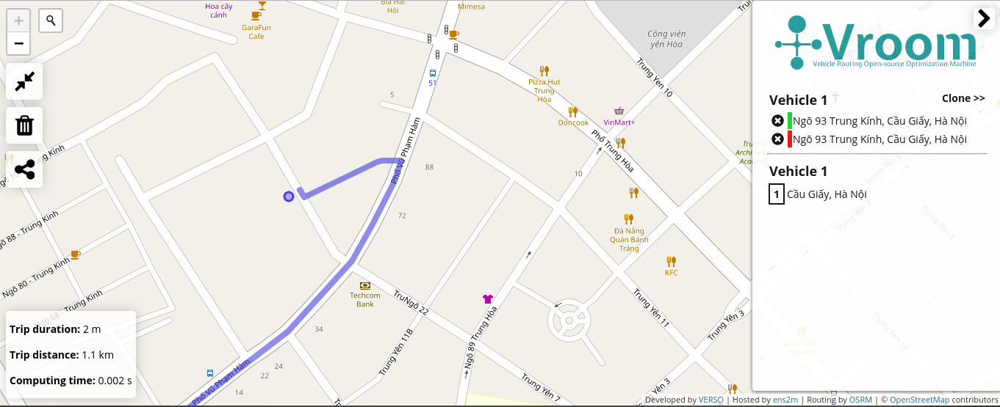

# VROOM

## VROOM là gì?

VROOM (viết tắt của Vehicle Routing Open-source Optimization Machine) là một công cụ mã nguồn mở tối ưu hóa cho vấn đề định tuyến xe chủ yếu dựa trên OSRM, phát triển bởi [Verso](https://verso-optim.com/)

## Đặc trưng của VROOM

### Nhanh

- Tìm đường khá tốt với thời gian tính toán thấp.
- Có thể  mở rộng quy mô để xử lý các trường hợp lớn

### TÍnh mở

- Giấy phép BSD
- Dựa trên dữ liệu của OpenStreetMap
- Tích hợp đầy đủ OSRM và Openrouteservice.

### Tùy chỉnh

- Hỗ trợ ma trận chi phí người dùng tự định nghĩa
- Có thể mở rộng để làm việc trên bất kỳ công cụ định tuyến nào.

## Cách sử dụng

VROOM cung cấp một API để tìm đường đi ngắn nhất qua các điểm người dùng yêu cầu. Lộ trình có thể  không đi qua các điểm theo thứ tự.

### Cú pháp

```
POST: <domain>
```

Trong đó: *domain* là tên miền hoặc địa chỉ máy chủ.

### Đầu vào của API

Đầu vào của API là 1 đầu vào tiêu chuẩn (đối tượng trong request body) hoặc 1 tệp định dạng json. Nếu sử dụng tệp, thêm cờ *-i*.

Đầu vào bao gồm:

|Khóa|Bắt buộc|Mô tả|
|-|-|-|
|jobs|Có|mảng các đối tượng *job* mô tả các địa điểm muốn đi qua|
|vehicles|Có|mảng các đối tượng *vehicle* mô tả các phương tiện di chuyển|
|matrix|Không|Ma trận 2 chiều chứa thời gian di chuyển tùy chỉnh thay thế |

#### Job

Mỗi đối tượng *job* có các thuộc tính sau:

|Khóa|Bắt buộc|Mô tả|
|-|-|-|
|id|Có|số nguyên định danh không trùng nhau|
|location|Bắt buộc nếu đầu vào khôn có *matrix*|mảng tọa độ|
|location_index|Bắt buộc nếu đầu vào có *matrix*|chỉ số của hàng và cột có liên quan trong ma trận|
|priority|Không|Mảng số nguyên mô tả độ ưu tiên. Mặc định là 0. Giá trị trong đoạn [0, 10]|
|time_windows|Không|mảng các đối tượng *time_window* slot hợp lệ để bắt đầu *job*|

#### Vehicle
Mỗi đối tượng *vehicle* có các thuộc tính sau:

|Khóa|Bắt buộc|Mô tả|
|-|-|-|
|id|Có|số nguyên định danh không trùng nhau|
|profile|Không|Phương tiện di chuyển. Mặc định là *car*|
|start|Không|mảng tọa độ xuất phát|
|start_index|Không|hỉ số của hàng và cột có liên quan trong ma trận xuất phát|
|end|Không|mảng tọa độ kết thúc|
|end_index|Không|hỉ số của hàng và cột có liên quan trong ma trận kết thúc|
|time_window|Không|Giờ hoạt động của *vehicle*|

#### Chú ý

- thứ tự của tọa độ luôn là [lon, lat]
- đại lượng thời gian luôn là giây
- đại lượng khoảng cách luôn là mét
- *time_window* là một cặp nhãn thời gian có định dạng [start, end]


##### Vị trí Vehicle

- Thuộc tính *start* và *end* là tùy chọn cho một *vehicle*, miễn là có ít nhất một trong số chúng
- Nếu *end* bị bỏ qua, tuyến kết quả sẽ dừng ở *job* đã đi qua cuối cùng, sự lựa chọn được xác định bởi quá trình tối ưu hóa
- Nếu *start* bị bỏ qua, tuyến kết quả sẽ *start* ở *job* đã đi qua đầu tiên, sự lựa chọn được xác định bởi quá trình tối ưu hóa
- Để yêu cầu một chuyến đi khứ hồi, chỉ cần xác định cả *start* và *end* với cùng tọa độ
- Tùy thuộc vào việc có cung cấp ma trận tùy chỉnh hay không, các trường bắt buộc tuân theo logic tương tự so với *location* và *location_index* của *job*


##### Job ưu tiên

Có thể đặt giá trị ưu tiên cho *job* với thược tính *priority*.

##### Khung thời gian

Người dùng có quyền quyết định cách mô tả các khung thời gian:

- **Giá trị tương đối**, ví dụ: [0, 14400] trong khung thời gian 4 giờ tính từ lúc bắt đầu, tất cả các lần được báo cáo ở đầu ra với thuộc tính *arrival* đều liên quan đến thời điểm bắt đầu.
- **Giá trị tuyệt đối**, nhãn thời gian "thực". Tất cả các lần được báo cáo ở đầu ra với thuộc tính *arrival* có thể được hiểu là nhãn thời gian.
Việc không có khung thời gian trong đầu vào có nghĩa là không áp dụng ràng buộc thời gian. Đặc biệt, một *vehicle* không có thuộc tính *time_window* sẽ có thể phục vụ bất kỳ số lượng *job* nào và một *job* không có *time_windows* có thể được đưa vào bất cứ lúc nào trong bất kỳ tuyến đường nào, trong phạm vi được cho phép bởi các ràng buộc như khung thời gian của *vehicle*/ *job* khác.


#### Matrix

Là một ma trận thời gian di chuyển tùy chỉnh thay thế cho ma trận thời gian di chuyển được tính toán bởi công cụ định tuyến. Do đó, nếu một ma trận tùy chỉnh được cung cấp, các thuộc tính *location*, *start* và *end* sẽ trở thành tùy chọn. Thay vì tọa độ, chỉ số hàng và cột được cung cấp với *_index được sử dụng trong quá trình tối ưu hóa.

### Đầu ra của API

Đầu ra viết dưới dạng JSON, có thể xuất ra tệp (sử dụng -o), gồm các thuộc tính sau:

|Thuộc tính|Mô tả|
|-|-|
|code|Mã trạng thái của response|
|error| Nội dung lỗi|
|summary|Tổng kết các tuyến đường|
|unassigned|mảng các *job* chưa được gán|
|routes|Mảng các tuyến đường|

#### Code

|Giá trị| Trạng thái|
|-|-|
|0|Không có lỗi|
|1|Lỗi hệ thống|
|2|Lỗi từ đầu vào|
|3|Lỗi định tuyến|

#### Summary

Các thuộc tính của *summary*:

|Thuộc tính|Bắt buộc|Mô tả|
|-|-|-|
|cost|Có|Tổng chi phí tất cả tuyến đường, sử dụng trong mục tiêu tối ưu hóa (hiện bằng với *duration*)|
|unassigned|Có|Số lượng *job* không được cung cấp|
|duration|Có|Tổng thời gian đi tất cả các tuyến đường|
|waiting_time|Có|Tổng thời gian đợi tất cả các tuyến đường|
|distance|Bắt buộc nếu sử dụng cờ *-g*|Tổng chiều dài tất cả các tuyến đường|

#### Routes

Các thuộc tính của *route*:

|Thuộc tính|Bắt buộc|Mô tả|
|-|-|-|
|vehicle|Có|Id phương tiện trong tuyến đường|
|steps|Có|mảng các đối tượng *step*|
|cost|Có|Chi phí tuyến đường, sử dụng trong mục tiêu tối ưu hóa (hiện bằng với *duration*)||
|waiting_time|Có|Tổng thời gian đợi tuyến đường|
|duration|Có|Tổng thời gian đi hết tuyến đường|
|geometry|Bắt buộc nếu sử dụng cờ *-g*|*geometry polyline* tuyến đường|
|distance|Bắt buộc nếu sử dụng cờ *-g*|Tổng chiều dài tuyến đường|

##### Step

Các thuộc tính của *step*:

|Thuộc tính|Bắt buộc|Mô tả|
|-|-|-|
|type|Có|Loại step. Giá trị start / job / end|
|arrival|Có|Thời gian đến dự kiến tại step|
|duration|Có|Thời gian đã đi tính đến step này|
|location|Không|Mang tọa độ cho step này|
|job|Không|id của *job* tại step này|
|waiting_time|Không|Thời gian đã đợi tính đến step này|
|distance|Bắt buộc nếu sử dụng cờ *-g*|Độ dài quãng đường đã đi tính đến step này|

### Ví dụ

Với 2 *vehicle* và 6 *job*, đầu vào tương tự như sau:

```
    {
  "vehicles": [
    {
      "id": 1,
      "start": [2.35044, 48.71764],
      "end": [2.35044, 48.71764],
      "capacity": [4],
      "skills": [1, 14],
      "time_window": [28800, 43200]
    },
    {
      "id": 2,
      "start": [2.35044, 48.71764],
      "end": [2.35044, 48.71764],
      "capacity": [4],
      "skills": [2, 14],
      "time_window": [28800, 43200]
    }
  ],
  "jobs": [
    {
      "id": 1,
      "service": 300,
      "delivery": [1],
      "location": [1.98935, 48.701],
      "skills": [1],
      "time_windows": [[32400, 36000]]
    },
    {
      "id": 2,
      "service": 300,
      "delivery": [1],
      "location": [2.03655, 48.61128],
      "skills": [1]
    },
    {
      "id": 3,
      "service": 300,
      "delivery": [1],
      "location": [2.39719, 49.07611],
      "skills": [2]
    },
    {
      "id": 4,
      "service": 300,
      "delivery": [1],
      "location": [2.41808, 49.22619],
      "skills": [2]
    },
    {
      "id": 5,
      "service": 300,
      "delivery": [1],
      "location": [2.28325, 48.5958],
      "skills": [14]
    },
    {
      "id": 6,
      "service": 300,
      "delivery": [1],
      "location": [2.89357, 48.90736],
      "skills": [14]
    }
  ]
}
```

Đầu ra như sau:

```
    {
  "code": 0,
  "summary": {
    "cost": 18671,
    "unassigned": 0,
    "delivery": [6],
    "pickup": [0],
    "service": 1800,
    "duration": 18671,
    "waiting_time": 0,
    "distance": 316682
  },
  "unassigned": [],
  "routes": [
    {
      "vehicle": 1,
      "cost": 6526,
      "delivery": [3],
      "pickup": [0],
      "service": 900,
      "duration": 6526,
      "waiting_time": 0,
      "distance": 99924,
      "steps": [
        {
          "type": "start",
          "location": [2.35044, 48.71764],
          "load": [3],
          "arrival": 30137,
          "duration": 0,
          "distance": 0
        },
        {
          "type": "job",
          "location": [1.98935, 48.701],
          "job": 1,
          "service": 300,
          "waiting_time": 0,
          "load": [2],
          "arrival": 32400,
          "duration": 2263,
          "distance": 34937
        },
        {
          "type": "job",
          "location": [2.03655, 48.61128],
          "job": 2,
          "service": 300,
          "waiting_time": 0,
          "load": [1],
          "arrival": 33612,
          "duration": 3175,
          "distance": 49794
        },
        {
          "type": "job",
          "location": [2.28325, 48.5958],
          "job": 5,
          "service": 300,
          "waiting_time": 0,
          "load": [0],
          "arrival": 35501,
          "duration": 4764,
          "distance": 71312
        },
        {
          "type": "end",
          "location": [2.35044, 48.71764],
          "load": [0],
          "arrival": 37563,
          "duration": 6526,
          "distance": 99924
        }
      ],
      "geometry": "skihH_wiM??IbC?^?f@@l@NpEJlCJzCJvCDxA@t@?r@@jBAbBCjBC|@KrCAD[|D]hDYvCOvAk@bFW~BQpBKbBE`B?vBFbBDjADvAAz@E|@Gj@G\\IPKJEJCJAL@H@NBHDH@P@`@AZCj@?RA|@@|@F~BBjCB`YBbN@xABnAFz@L|@Jf@Jf@Tv@lDbKZdAP`APpAFtA@jA?x@ElAChA@|@JlA`@xCt@|FTdBF~BA^AXS\\I\\E`@?XBXH\\JTNPXL^?TMRSL]F]@]LYLWRWRW^a@d@e@f@g@`@St@QpAWdBYh@?b@FZHh@X\\^\\`@N`@FRLj@?JIp@W|@CBw@|AOTOPi@x@_@p@S\\c@z@_@nAIPq@lAUb@M`@EZA`@@^Fj@Nj@Fl@?dAShEK~BMnBA^K|AOpCqAtQQpCQfC{@xMKvAWrDkAzQIbAGn@KtAc@bHIdAGd@yA`U_AvNMp@mAdQ_ApKiAdKsAfK_AxGkBjK_AdFc@lBe@xB_CrJqBtIuDhNIReB~EwBvFwAzDOh@Ij@Gn@Cj@@bAFn@Hh@N~@Pn@N^Rd@X^^^`@T^Hh@Fn@D|@DhDL|ADhAJ`@D`@HbARfARpF|AdD~@|Ab@|SdGxErAj@PhCv@pCx@fF|AdEnAfBh@vBr@nAf@rAp@xAx@dAr@`Ax@v@t@t@t@t@x@fAtA`AtAzAfCdAtBpAnCfB~Fv@xCv@vCtBpIbKpa@vAtF`AtDhA`EjB`HjBfGjAxDh@zAvAbEfBbFh@vA~@fC|@xBRh@b@jAlEjK~GnNJz@^t@Hd@n@lBrCbK`AlDXlAHf@Dl@@d@Ah@?r@@d@@vADdAF|@JpARjBXtCr@pHTpBNvAPz@T`Af@fAT\\RX\\XZT\\N\\N~@T`B^vAZ|@^\\P\\Rh@d@d@b@b@h@Zd@`B~BxArB`@p@Pf@Nh@JZXv@DJVj@PX\\n@f@n@RP`Ab@l@`@VXr@fAhCxDb@p@PZp@rAXv@Vn@d@vAj@dBPn@Nl@VjBDr@Dx@@b@A`@?PCJCTC`@APD`@L~BFb@FTFPJPPVTLNPNRHb@l@`KDr@VvEHhBHnBPpGFpB@r@@n@@j@?jB?nCC`BCtA?XGlBGdC?l@AfE@lADjABn@Bx@LxB`@~DLpANtAVxB^rDDdA?dAGtBKtB{@pKIbAEfA?pA@p@F~@Bv@?p@Ch@Gj@I`@GJWLSRQb@Kl@?j@BZH^Xd@XRRNL\\JxAB|@A|AAjAB`AFpA\\zB\\tGB|AHlBH~ALnBTdC\\jD\\nC^nCf@jDJz@x@pGp@jFn@rC^tAHn@AN?NBNDJHHHBHARXnCfGxClGd@~AZtARhARnANjAJnAHnADrABzAAfBEnAKlBQpBW`BWtAa@vAa@nAeAhCyA|CwAhCsAdCQ^MXI\\Kh@Or@GRIHMBMFMJINGPGRANAN@ZBXFVJRJJJHLDL@L?\\R\\`@Vf@\\`AVx@Z~Ah@lDv@~DTpAtBzKhA|Fv@pEXtBdAhIzAjMr@`G|ApHVbCAtAA\\ETGXGRITGLKLOHU@QJU\\If@A`@F`@J\\RRJZBLBXBv@Bz@F~@Dt@B`@D\\Jp@Nz@bDxPjDpQzAdI~AdIrDfRpR~`AwMdEOHMNOb@Mf@SnHG`BCpA[jD]dDQ~AcBxJWvAUtAs@jDs@|@a@b@Yh@]xBs@zEMx@Ix@Gx@I~@OxBUrBMf@w@pDk@jFyAlPcAnFcEtLw@fE]rBUrAGfAAfAFr@F^HRLLPHJJHRFVB`@G?IDEJ?NUGWGKC_AKI@I@OBmB`@_@JM@@\\BHBJRh@Vr@Vp@HTDP@TA\\YbCSfBAX?XQL{AdDAD}@vBe@jA[t@k@zAU~@ETW~ACHIb@YvAOv@ShAM~@Gz@I`Be@`HOzBQzBCn@?j@@l@Hx@@V?TCRKXMRa@b@iAnAuBhC_BrBg@v@[n@Sh@Mf@Kt@YnCI^KZOPYPQFWBSAMGIIMSeFyHIMMGGCE?Q?Eh@yAvKc@nCo@pEKr@u@bF_@hCw@rFEr@E|@Ar@MhTCjCBrAd@`MHtB@|AGpAObDg@lH[jFKn@KHWCuAIo@BU\\q@lAs@bAeAd@kAz@iB\\iAxA{AtCY~A{AnEeBfG_AvDoBpHKb@kAlFu@fCw@`Cm@~AMBKRCN?JINUVk@p@q@x@y@xA]l@]Ze@Xu@Tm@JWHm@d@qB~AgA~@WZIPGLsCeDoA}@gOwJ_Aq@mAeAuB{BqAuBa@}@]eAeGjCg@\\a@n@iGvRI^EHGBQ@QDg@BIPGTEXCtAF`BA\\G`@KVQVwBbDu@hAIXINOLMFMAOCkHmC[UO_@m@cAIb@Ov@_@`BGv@GbAAVE~AYrOAd@Eb@Gd@qAtKoCxUu@bGa@dD_@nCUzAUnAsCbOq@nDG\\ETCTTfWDtD@zD@b@@XJj@Jh@D^FHJVNn@Hh@DVL^Vp@Pj@`CtEHNP\\ZZb@R`@JVP\\VLN^_AHELLJXPIHI??[m@OHINID_@~@FFJNHNXbARn@R`@NVJPNN^Xr@f@b@\\Z^T`@n@fAvApCjA~Bf@~@RXPPXRfAr@tBlAjF|CnF~CdAl@pAt@bDlBvC|AbCvAxBpA|BlAxP|Hr@\\n@R\\w@h@sBvAoG`AoDLYj@qAlBcD|AeD|@{BPg@\\{@JSLQPMRGb@I`@Gh@Av@?tA@h@?\\At@Gl@Ab@?vACd@Oh@SfCeAjB{@t@Sz@]p@Sl@Cb@BlAb@|@XZ?\\KfAaArAwAzAiCbDmGdAqBv@gApA{@lDyBz@i@aBoF_@oBCWIk@^U|DsEZYTMXMZEJ?P@d@JzBv@bNrEz@PD?x@LnGn@bFf@XB?F@J@HFHDDB@H?FCHGDO@I?ECQEMGGZgBt@cEzNcz@@EjFkZtIif@DQ`FuX`@eBd@aBz@qC|Reo@|@wCr@kBl@kAb@o@x@kAbBqBnEwFxRcVlBaCh@o@h@y@d@cAHYRo@V_AVsApAgHZoBPsALsAx@yIHw@L{@Lw@P_AjDuOdBgIXiAVq@f@eAf@aAN_@Ru@Ho@rAj@XLXTb@^PNf@^\\Vh@X\\N^LfAZ~@X`@J~@Zn@\\HDRLx@f@dAf@v@V~@`@hAb@t@Th@RTFRRRRLTJTHPLRHXJ\\TLXNVDRDVFTFVRX\\\\\\`AdA`A~@v@|@dA`Ax@p@x@n@f@ZtAbAfBfAtA`AfBjAtCnBrAz@|AfAlBlAx@d@z@uAT_@PULYAe@?a@@K?QBWBKFUr@}@JSRYFQJc@PgAJ}@Fu@Do@AQCq@?YBg@BWJ_@FONMJGL?XAD?N@PCNCNGPYb@iABGDKTk@t@yBl@oBBIRm@\\gAPo@^qAV{@J_@VaANw@BMJ]@Gx@jAbCjDlAbBn@|@`@l@`@j@Xb@V^Xf@NX\\t@p@|Ap@zAn@zA`@jAZ|@Vx@t@~BRl@L\\`@~@Rb@Xj@RZXh@NTb@n@Zb@d@j@NPXXTVb@`@TPd@\\XTXPXPXN^RVLXJXJ`@N^Jz@VjAb@^Pz@VP?ZJTHPDb@JdAZh@Nl@Ph@Pb@L`@Tn@\\^Tj@`@LJt@x@f@d@Z^VVl@v@PXDSBGDKNe@L_@Ty@|AuFdCqJd@iBtAsF??r@kD|@qDz@{Cx@iC~@iBHQjH}MbByCbB}DtByDp@sAVa@HOFK^e@HKVUfA_AlAsALObBkAXQ|BuAb@Yn@e@LIhA{@fB{ArAgAvAsAxBmBVUVUzM{NROzAiBjCmCbDkDRS`B_BTS|@{@bBcBLKRW|EmEtAgBtAiBtAgBJMt@iAXY`AeAfAaAhAmAHMBDFDD@D?D?BABC@G@ICIAE\\UXM^MRGv@UxBk@LEFCDC@CBE?GHcBTeCHkA@kAC{@E}@q@aEe@gBI_@E]CkACw@IiEAw@B[@ODKf@u@^c@POPGXKtASx@IjDUpAK`@Ib@Mb@Wb@]f@u@P]Ne@dBeGfByFx@sBv@wBp@gCn@gC|A_Gn@aCp@oBdCaG~@_CZ_ATgAlBuI~AwEjBeEx@kCvAmGpBgF~CcI~CiGBEvEaItAaC~AuE^s@`@o@tAcBT_@Pa@z@mCfAeCDM?WGeD?_A@ODc@RFlAT?w@B_ABm@Bi@HuBBy@@_AAq@KyAEa@Os@YgBI{@@mABeADe@RaBnAgEv@wDNmAJuAH{AByACkBIcCYgEIyACqA@qA@mFA{@Au@CaA]aFy@iMkAsRq@yI[kESuBQwCQwB[yKu@_WIwOGeK?}@?e@Ag@Ck@E_A@_@JY@YGYCa@Cw@A{A?e@@g@FmA@e@?WA_@Ac@Ea@Gm@Gy@Iq@S{B[eCYkBWqAWiA_@cB]{A]_B_@uBQq@Sg@Ug@k@iA{@kBcCcFk@iAc@cAUi@Qo@Os@Ks@Ky@IoAKkCKaDSqGe@sNa@{K[}Ja@cMEiA]sJC[EkAAu@Au@Aw@B{D?uB?eA?oAEuAEmAGsAIy@OaBQqAUaBSuAoA}HKiABg@Ha@HGHMJ[@a@E[CIGOOOKa@[s@kAkDaAiEYkBUkBSsCKmDGmFAwAE_BIgAWwCOwAQgAUiAk@_Ce@cBs@yBwBoGgB_Gm@_Ci@oCYkBUcBYsCe@cG[mEa@mEc@eEYsB]wBa@qB]yAi@wBu@oCgCuImFkQ]uAk@aCEY?YDU@]E]IWMMMEKAK@OGKSIa@Mq@Uw@Uu@Yk@mCaJgCqIg@cBe@}Aa@cBa@kB_@sB]gCOcBM{AIsBIqBIyDK_GSgJHmBBsAB{@Bk@Fs@Fi@H_@NIJSBUAWESKMGuAKoBKyBIy@My@]}Ai@eC]uAi@{B_AeEg@qDu@kGM{@[qAUq@[m@e@m@OQYS]Oi@O[Gm@AsC@[I_Aa@_@s@Se@E[IYKUGo@?WBc@Fi@n@sJVuDDu@`@eGf@aHT}CFs@Hm@L_AN}@Ps@Nk@Xo@Xe@\\?ZKTYPc@Dg@?m@Ig@F]DQHMLGTCv@CXCJC\\I@C@C?C?w@?W?cA?sB?eA@YBSFUl@yBdAuD?W?OAOEMEMe@k@g@q@MQc@k@EESYCQCSAW?W?_@@YBSDSXiAHa@Lu@BYHy@@_@@g@@UDQFQHMTYvBoCT]bAoAZk@RNNSz@}AJQR[FMFODKBM@M?MAMAQGc@Gi@E_@E[Ok@CQC[AWAOAS?Q?i@@c@AWAa@Cc@Ca@Ga@Q_A?M@O@KDKFGZYRSNQRYRSXm@La@lAkCRc@~@uBRk@WWaD_DM]@Y@I@KAKAIEGEEEAc@k@Qc@I]w@sEKy@Ew@GeAA[AWA]W{DCQAk@BqCDqD?k@Ba@FcDAg@@i@BoAFoA@e@@_@DQD?DCBI@IAGCGECG@CSAKKcAAMEYAm@EuAAoBCcAKgB]cD]sDQoAY_BYwAEQa@mBQo@Qm@IYG]CM?ECUAQAIA[?[A[@s@As@As@A[Cg@EWEQFEDI@KAK??EIGEG?Cu@AgAGwBGcBGgAGi@E]Km@Og@Us@a@mAUo@Mk@Ia@UsAGa@Mm@K_@ESGe@Ea@WyBWcCGi@Km@Ie@Mm@Mk@]aBCMOs@]cBa@kBa@eB]uAa@wAkBmGq@_Cc@cBSy@Oe@o@cCIe@Kc@YmBGOEMOSKIOIUGOC]KgDy@yD}@}@[UEe@IIAa@IOESGYK[O[MiAg@aAa@q@Ya@QOEKAIEIGy@s@KEUUIGMOWUo@i@aBuAq@k@s@m@[]KKAAAEECCAE?A@A@GAO@IHELYt@a@dASd@O^_DnEa@j@}@nAQVmBhCqAfBaB~Bu@gAkA_Bq@{AQ_@ILW\\OXOZEHCHEXMz@Il@Kj@GV]|@Wl@s@rAwA`CWl@M^OV[f@[b@UTYRo@XQLONOPMP[b@e@~@i@jAMROZM?OEKCS@UKUQOWMe@G[?q@@s@?UASK[GOAACEMQQOIMcAWYIg@KCAo@Sk@Us@Y_Aa@m@e@]g@{@wAW[YU_@S_@Oo@QYI[I[OWU_@WEEKGu@c@IGMQ??BG@O@O?WCWEOCGCGIKGIKEKCKAKBMDIFGHGJELCNCX?P@N@PDLDJDHFFFFBb@Ab@CLEXKbAEZKXMROJQ@MCOIMQKYQcAOQGc@W}AwA}Ie@aDSgBOqAMkBIcBGaBEyACgBEoJEqEA_E?uDEoTCeNAeD?uH?kBE{PAqD?oD?iC@kBBkCJqHVmTFsE@}A?qACwACqAIkBOoBKaBOqBk@_Ii@kHG{@WkDi@qHYoDWyD[cEOaCGqAEiAE_AIkCGmCEkDAiCAmC@cB@cBBkBDeBLgEJgCNwC@IVmDLuATgDFeATsERiELqBNwBLcBh@}GHcAdCe[TmDVmFPmG^sSLcHDiCV{ONsKJcFJwDJmCR_EPsCZeFLqBHeBHmBBcADsB@wAAcACqAGuBEmAIiACg@OyASaBYiBMs@_@sBe@aCu@wCaBeGaB{F}AiGg@uBa@kBe@qBEUUy@Oe@Qe@Uc@Wa@[e@Y]SQWOUOm@We@K_@G_@Aa@@]B_@Fc@L]Ng@TYJQJo@Rk@Ng@Ha@Bg@?e@?q@Gu@Ik@Ge@IQEMGOKMKMOOSWe@Yk@Wm@KGUq@Oo@Qw@_@uDMg@a@wC{@eGI_@MQ_@m@o@i@i@Oq@Lk@b@[n@Ut@O|@EvAApAEh@@fBE`BU|Aa@rAm@tAYn@KTqEpJiBjDQ\\aChEyDlGm@bAyAnB_CpDgDjDkClCuBzB}C~CyPzPsBtB}F~FgHhHoErEeJ`JaKxJaB|AyBvByBxB}A`BaAjAyAhBwApBkAfBiAjB_A~AwAnC{A|CuExJuExJcC`FgA`CcBnDyBtEmCrFgCnFyBtEy@hB]t@s@hB}@nCm@~Bm@pCa@jCY~Bq@fFM`AcArIK|@_@pCo@zDg@jCsAvF{BlHi@zAwEvKcBvDiAbCqA~BcA~AmA|AoA`BsFlGyBhCaAnA}@jAm@|@c@r@aAbB}@jB{AvDgAzCeB~E[|@wA|D}BhGo@rA{@`Ba@r@e@r@U`@oCbDwCrCoNbLeDhCePfMwAjAuK|IsC~BaF~DiCxBwArA{A`BeHjJeL~R_LdSkIjNwAzBoA`B{@bAgAbAqCfBoBx@iBd@yAXwAFs@@iA?IMSAgASkA]uCcAcAe@{@q@c@g@]i@YcAE{@Be@H_@Zq@HWNUv@}ABCXa@HILIJCH@H?HEHIDKBQ@K?OEOEKGKMEI?_@QQQa@k@]_@m@a@e@Sq@KqBXwBZeATm@f@e@p@k@p@SJSBQ?QCWWOGQCOYGS[uBUeBu@}Fa@yCKmAA}@BiADmA?y@AkAGuAQqAQaA[eAmDcKUw@Kg@Kg@M}@G{@CoAAyACcNCaYCkCG_CA}@@}@BWB]F[F[JWLKDKDQ?MAOEOEKCUA]?k@@_A@{@EwAEkAGcB?wBDaBJcBPqBV_Cj@cFNwAXwC\\iDZ}D@EJsCB}@BkB@cBAkB?s@Au@EyAKwCK{CKmCOqEAm@?g@?_@HcC??"
    },
    {
      "vehicle": 2,
      "cost": 12145,
      "delivery": [3],
      "pickup": [0],
      "service": 900,
      "duration": 12145,
      "waiting_time": 0,
      "distance": 216758,
      "steps": [
        {
          "type": "start",
          "location": [2.35044, 48.71764],
          "load": [3],
          "arrival": 28800,
          "duration": 0,
          "distance": 0
        },
        {
          "type": "job",
          "location": [2.89357, 48.90736],
          "job": 6,
          "service": 300,
          "waiting_time": 0,
          "load": [2],
          "arrival": 31795,
          "duration": 2995,
          "distance": 62691
        },
        {
          "type": "job",
          "location": [2.41808, 49.22619],
          "job": 4,
          "service": 300,
          "waiting_time": 0,
          "load": [1],
          "arrival": 35915,
          "duration": 6815,
          "distance": 131640
        },
        {
          "type": "job",
          "location": [2.39719, 49.07611],
          "job": 3,
          "service": 300,
          "waiting_time": 0,
          "load": [0],
          "arrival": 38090,
          "duration": 8690,
          "distance": 154519
        },
        {
          "type": "end",
          "location": [2.35044, 48.71764],
          "load": [0],
          "arrival": 41845,
          "duration": 12145,
          "distance": 216758
        }
      ],
      "geometry": "skihH_wiM??IbC?^?f@@l@NpEJlCJzCJvCDxA@t@?r@@jBAbBCjBC|@KrCAD[|D]hDYvCOvAk@bFW~BQpBKbBE`B?vBFbBDjADvAAz@E|@Gj@G\\IPKJEJCJAL@H@NBHDH@P@`@AZCj@?RA|@@|@F~BBjCB`YBbN@xABnAFz@L|@Jf@Jf@Tv@lDbKZdAP`APpAFtA@jA?x@ElAChA@|@JlA`@xCt@|FTdBF~BA^AXS\\I\\E`@?XBXH\\JTNPXLT`@HTBVFv@e@nEo@nFw@~C[tBcAnKGf@Eh@U`B_@rA_@`AsAhCuAjCo@jAg@fAk@xAUl@UC]CqBMsDYsFi@}AIq@EEAUEm@ESAcDYgDWgC]iEk@y@OaAY{@]}@a@uAu@MK}@q@q@i@aB}Am@q@k@u@q@{@o@cAsEwHeEuG{CiFiEqH_DoFqCeFgIyOy@mB[m@wBcEqA_Co@oAs@sAkAiB{@kAs@}@gAkAs@o@q@k@eAw@oAs@sAq@a@_@}EeCwDsBuAcAq@g@k@g@gC{BgC{BiM{LgB{A}BoBaAw@cBqAqGaFcH_GeHoGcFoEU_@wEoEs@cAg@_Ao@}AoAgEc@mB_@qBOiASaBQqBImBEsBAoBB{AFkBHoAJ}AAi@jAoOz@wLfAyNNeB\\_Fd@_Gn@_JRcEJaDCs@RqMB{L@iC?{CWu]QwUCmD@{A@w@DaA`@oLJ{@f@aN?aB@qBKeCUeCMaAQkAk@_COYkAsDCI{@mBg@_Ae@w@eAqAs@s@gAy@WMaAe@eA]iAW{@I{BG}@DM@u@N{@Tw@\\mBhAeRtKwR~KaBdA}@\\s@Nw@Bu@@w@E{@Qc@OqAw@g@e@k@u@i@_Aa@}@a@oA[uAQiAK}@G_AC]mCwb@iBkZeAmMk@uEMgAy@aFoAqG{AqIgAyHq@qF[qEOwFCcI?aDA}AMaCAQOqB}@}EiA_EyCsJwA}E_AmEa@wDKmCAoBXuJ`Ak[By@NuEF_D@{CAsBQcNAm@GcEKyIEwDCgCC_BGgDEyAGmAKsAQyAO_A[wAc@_Bg@sAo@sAeA}A_AaAs@o@q@a@_Aa@}@Wu@OkAMuA@gALcKzAUDsF|@uKv@kHDqBCe@EqEU{Eq@wB_@cCe@uAYSCuA[qDmAiC_A{FmCqBeAy@m@]]yE{CmByAgA_AgCwB_CsBQOkEkDqC}AiCiAeBo@gBi@wBe@m@IoAMoAMqAGqAGy@EcJQaBCo@CcFK_CGy@CmADs@Aq@?s@@i@Bs@FyALeBJ_AAoAQ}Am@w@k@s@s@w@eAo@gAi@uAe@}A]oBo@wDKk@e@oBa@wAyAeDo@{AsAyC{BgEWOYq@oDuI{CaHuAoCaA}AqAoAwAgAmAg@_BYuDm@aBa@sAk@mA_AiAmAo@mAy@aBe@yAc@iA]qA_@iBYwA]kBg@eCe@mCg@gDq@}F}@cKmBiV}@eM[eDm@{H{Be[u@kMY{KAgHFeH@mABs@N_DR{CXqC^}Cp@eEhA{FzA_Ij@aD`AkGh@mEf@iE^wDXiDLeBNuBp@}Ir@gQv@iWR}FB}@FcDBeDG_EKsCQgCSkBYyB_@qBk@gCo@yBu@sBs@aBcAmBe@u@iAcBkD}EqB{CaA}A_BmCcB{CcBaDy@_BwBkEeAuBkCwGqBkFGOa@gAeBkFkBqG{@mDYyA[yBWsCSmDEcC?_B?u@BoBBqBHeEBqAD_BFiDLgGFeE`Ame@zAku@\\{Pt@m_@VoMHeEXaOHiETaLPuFZmHj@aKTqDv@uJRuBd@}EbAqI`Es]vAyLfCuWv@aJ\\}DxA{WVgHb@wQJwHFwPC_FAuDKoIMuI{@{XIeCgAaZm@cQGoAOaE]kIu@iS{@}Vk@sOa@iN[aNGcGGyG?[?q@Ak@AoEAiHDyHFkEJeIFaDTuJPuHj@yUvA_n@jAgf@HwCnCylAhAoc@b@iTp@kY\\oNhAqd@NwIRqND{PG{IIcKu@i[oBam@mGioBmAw^eAq[cGokBOoEiAyY_@mHeA{Py@mJa@aEg@iEg@gEm@wEcBuK{@aFw@qEY}@uBeKsA{FqBeIyBaI{D_MmD{J}C{HuAeDgCsFaCaF{HuNoIsMaCeD}EiGuAcBcGyGe@e@}EwEg@k@mC{CoAwAaGoG[]OMcJeGqBmA_C}AwEcEgGgF}GuGaFqFuDiE}AoBuC{DsC}De@s@a@o@iAgBgAeBiAqBaAcBu@uAeAmBeAuBsAoCuAwCwAaDeCcGsAmDuAuD}CeJiCyIqBwHaCsJcAmES{@YoA{A_HyA{Gg@}BqAcGiAmF_DiNoCyKoBcHwGiSsAwDA[gC{GkCsGyCkHq@kBi@gBo@kCe@gCsAsHm@qC]iAK_@Ys@Qc@S_@Sa@m@}@_@i@i@o@q@m@w@k@e@Yy@_@}@Wo@Mi@GyBG_C@mMNiGHo@EyDNsDTcDh@cGpBuG~CqO~Ku@h@mXbReEvB_DvAwGvAw@LI?EAGAIGKQMIKGGIIKGMe@uAk@{BoGwVnGvVj@zBP|ABV@L@LAXAVBXHR@\\Ah@Ud@e@v@}ArB_C|BqLpIyDfCkFzCo@Zg@T_@PcAXkAXsBZuANgBNe@D_@J]PyBlAMBI?QEQOUCSHQRK^C`@BTDRFNJLJFLPJPFVTxB\\nDRfC@jA?nAM|DWzG_@pLBt@IbCCnC?hB@dBBjBJlCFrAJzA`@bFVjDzAxSTfEFzBBpC?tCK~EOvCUdD]dDk@zD_@tB{@|DeBxFuBlFkA~BuAzBiDhEqDbDkCbBeClAkErAwFp@gCBsCGc[kC{MmAaNiAy@GeHm@aDWsBO{AQcAQ{@So@OoAc@aA_@oDoBiBaBsD}DeBkCaBuCc@aAcCyFw@yA{A}BsAuAiCeB_FsCyCeBu@c@SQOMMQEUEIMOSEKBMJSI[Mo@[u@]gAa@kAa@cAYoB[{CWcDQiBIuDSmHg@yCUiE[kFa@qHo@o@Ig@IkAa@{@m@sCyCeBiBW[OSEKCMAYCIAIQ[OISAQHKLEJCNGHGHKJMFWHSLYVUZe@`@WT]VwAv@uQjK}BrA}At@{@Xs@R}@N}@Ls@F}@Dm@?g@?a@C_@C}@IiASeAWoAc@gAi@kAq@_Ao@w@s@y@}@e@g@u@cAa@m@m@aAu@sAYe@W[WYSSUQWQ]OYIy@Qc@Ii@KUIUK[]Y_@OYMYYaAESAO@_@BEBIBM?K@QAMCSCKEIGKGGIEGAKAOBYCOG]U}@q@k@_@UU[]SYWe@a@aAWq@U{@YsAq@_Dc@gBWw@_@aAk@oAs@mAy@kAo@q@i@e@g@a@gAm@s@[qAa@eAQgAMuAEeA@aABeAHqAPcCd@g@LeAPa@Ba@@UYWGWDONIRCBE^?TKNMTURe@Xu@t@y@r@i@h@o@r@{@hAeAfBm@hAm@rAs@nBc@tAe@dBMf@o@nCq@nCaAbEwBlJeCfK_BzG{AtGg@rB[nAUr@Y~@Yx@[t@e@dAi@fAw@rAa@j@i@t@i@n@q@r@{C`DwB|BiGtGy@z@yD~Dm@p@e@f@y@`Aq@x@cC~CQRwFbHuDxEoEvF_DzDsBjCiBzByCxDqDjEUXQTORmClDeCdDmKxM}BvCkFzGkDnEmCfDoExFcApAo@l@g@d@q@j@]X[P]N[LODOBMGO?MDMJIPEXARBXGb@IZSd@qAlC}@|AORo@z@cAlAgB~BsArB}CfFsLjSs@lAmF~IwFpJaBnC}GnLyFrJ_@l@g@x@]n@WVQLM?GBIHENAN@JQf@Qb@o@dAsAbCuBfDaBpCu@nAqBlDaBrCw@pAMTwAnBu@v@k@h@uAjAeEpDcDvC_DlC{EbEaFjEaJ~H{IvHmJhI}EdEkThRuD`D[XkIjHk^l[kOrMgIpHsL~J_DnC_GdFkBbBoBbB_GhF_CrBsJpIkJhIc[jXeUbSkDzCkErDy@r@gA`AiPpNaAx@qHrGsAhAqE|Dc@`@MPi@jAmDjIkBlEwAfDYf@g@z@G?G@CBCDCF?F?H@FYj@[dA}@vBGPWh@i@pA]t@Wn@EHk@nA_AvBYp@{@nBc@fA_AxBg@~Ac@bAUh@a@h@O?KDIJEFAHADAJ@NCNCNO\\g@x@mAnBY^g@h@y@~@iAdAyCfC}@bAgApAaA~AiDhF_I~K{FfI_ArAaMhQoDfFsFzHILsC`EsNvS_FbHo@|@mObToAhBu@|@Uf@Sj@e@vAINMHGASDQPMb@?d@FZJRNJHNJ\\R~@^|A\\hA^bAdJxRvEzJn@vAh@xAp@`Cd@xBb@`CR~APjBLjBH|BDnC?lCMvCK`BMxASjBcAhIoEv^cAxIa@jDMt@G^I`@CNGXGXIXERELGLMFGHGLONKDMBO@SAUCWGYCeBy@qEsBc@M_@C_@D{Er@oDj@{AVkMnBeEl@aAPm@DSDKAICEGOMMWQa@Qi@Ye@uB{EsCuGWi@m@q@WOcEcBi@Uy@]}@k@iAu@m@_@YIMCgCkA_@MOCSC[AqDEe@CU?OCMG??UKa@[MGMEMAQB??UDQJ_Aj@]RaB`@WPOROTGTG\\EXCb@GjAEd@CRGRKXIRS`@Q^Wb@QXILIHIHIDMHUJ[Hw@PUDsAX[FyEfA[Jk@X_@Vg@b@c@b@qA`B{AlBcBvBwE~FYXUVe@`@MHEBiAf@}At@uAr@g@Vi@`@[Zk@v@{E`HoEnGs@fAGNYj@}GvOuA|Ce@`Ae@v@}BfDi@t@cH`KeCnDcCnDmLzPkDdFcCnDe@l@WZSPUNk@\\wExBu@\\aK~EyKhF}WjMmLrFsExBUJWL{G`DwC|AQLyBdBuAhAqEvDcCnByGnFwAlAo@l@aApAuHrLsElHeFbI{DbGsApBaBvBiB|Bu@n@m@h@k@r@}A|Am@f@k@d@{@f@i@Xe@Rs@X]HmBb@kANs@DaIPyJT_CFcCD}ACeBD_ABe@A]IGOEGGEMCK@EBKLELAFMDKD_@@q@B{@BiALc@Jk@Hq@LcAVw@ZkAh@m@\\i@\\m@d@i@b@s@n@qIfJi@j@wJlKaGnGiAnAaJ`KY\\QPaCpC}LlNkAvAwB`CORa@d@{BjCq@d@OHMBOBS?I?IGMAUDOLQVITGZA^@VBNFPHLHDNXFPBPDR@Z@XPbFBn@Bp@Bn@`@~HRzDh@vJZbGJxBVvEHxBFpAHpABRXpDHvAB`@@^?^?PAPAPCJEJGLCP?PBNBJDHLHD@JAHEHIDK@K@M?MCKCKEIGGICG?I@GDEFIDIBI@I?KCQCIAO?O@MDOFONIJINIPIZARAb@A^@Z?R@V?H?\\C\\G\\IVKTOPONQHOHqAp@y@b@KFi@\\a@Za@Za@\\_@^]b@]b@]d@Yh@{FvJuD|GaAdBmCxEKNCHmEvHqA|BuCbFOXQVsF~I}ArCwEhIqDnGgArBsBlDaB`D}@pBq@bB{@pCuApHWnCOxCGbCDjCBp@JvB\\zF~@|FlBhJ`C~KBLxC~NtGb[hCnJ`@vAhGtSb@rAxCxJh@fB|CfJ\\lA^vAJv@Pz@VdBJdA?TGTAV@VWt@gBrC}@pA[d@w@nAmA|AiJlM}L|PwBxCoEnGoEjG_LvOuBtCqAtA{@~@yAnA{@n@y@j@gCvAs@b@k@b@}@t@gA|@eAhAeDfDaB~A_BzAcB~B_B`CqAvBsAtCy@zB{@fCgA|D_AjE_CtKsD`QyDnP{AtGwAvGmDtPuAhHuAvJo@xEK~ASzBIzAYpCEp@KfBIzBEfCC|A@bCBzADpAL~BXfDPrCPbCNbDDxCIbFGvB[jDk@bEaAzEy@pCsHrU{A|F}@rEg@vEYbFAtDB|EJtCZlD\\nCBRFf@~@dIJ`BHhBC|Ea@nJo@pKATURQRIXCX?f@D^FPRZXPLBRFT?TCB?b@Md@i@TIRChCb@`Dj@pBf@zLhCtGzA|FvAjX`Gp@PzIpBtDx@f@LjAZtKbC~TdFlE`AdI~A\\HVLT\\DDFb@LTPLL@TCRSb@MVA~@RhDt@xHdBbJrBvIrB`IdBbE~@dDv@lEbAxA`@`GrAnDt@`@NPP`@d@DDHTNPXL`@TLXHTBV?REXM|@eE`Uk@zC_@vBkCnN_DzPwAlHwBnKyApHMf@GRINEHIFEBEBCBCDCFCDAFAF?F?F?F?F@F@F@V?NAPANCRGZAPIr@i@~Dm@lEM~@Iv@Cr@AbA@v@Bp@?DFv@TbCTtCDnBB|B@zAClCCx@G`AIp@Mp@eAfEW|@iAxEMp@Eb@?^@b@@b@Hp@Jn@Rp@Pd@Xt@fAdCR`@HVBJDJDTBTD`@?`@?\\A\\Gb@Ml@u@xCo@zBQd@cB|EyAhEITg@nAs@jCm@xBEJETG`@E^C^Iv@ObAGXKh@GR_@jAIRSl@GPWr@CHMXINEHSNq@p@CCC?C@Wc@uAoAQKOKOEYJi@NYHMEsA{@u@{BO@UDKRMd@CXKQe@qACG_@q@]k@MQs@e@CCOK{@{@IEE?I?I@iBGKAICMIwAs@QI]SUK}@c@OI_ASs@GiBOmAKc@ESAg@BM?K@KBK@[FG@G?u@Ca@CyDUG?G@IFcCjFITCPAJAL?VAVQpDKvCA@GlB?h@Fd@BHL\\lBpDtApCfApBRBvAO?V@T@p@FtAB\\Dx@rCOd@G`@GVGj@OzAa@v@QRERCvAMb@AhAAX?XCVEVIpBs@VIj@UfBi@|@W^Qf@W`DkBNGRCf@IP?P?N@RDRD^LLDJBZBCXCRAP@L?JDRFVJ\\Tx@T`A\\|A^~AXrA~@fEJ\\zBpI\\lA^lA`@fA\\z@b@|@b@|@j@|@h@v@f@l@tBxBv@v@dAbAhAlAv@`Az@fAv@lAj@fAf@|@`@z@j@rAZx@\\`AX~@HXb@bBVbANv@Jd@~DvTxB|LX`BTvAPnALlALrANfBLlBHlBBvAFbEFvBFrBLbCJ|ABVRvBLbALhAZrBb@dCtAdIXbBNdAP~AHz@TnCDn@HhAXbDDn@pArQNjBDr@BlA@n@?vB?t@@~A@l@@^Df@Fn@BT@V?H?J@LBHDHFDDBL@JCHKDKBM?K?K?Y?S@SAWEUK[Ok@Sy@Ou@COAO?QBOFKFGNKBATMNILGLGDE@?r@i@tBsAn@]HGLIDAvBuARKj@_@|@k@DCfLeHhJ{FvGcETMpD{BNKXS^]PWr@iAbDmHpAkCXi@Zc@RYT]RQ~GeGxKqJ~FgF~HyGvAkAf@Y^GJ@\\BtCbBjFnDdFrBjBn@lCbAtEx@PJJHFFFH?FBHHPJHJBLA@?JGFKDM@IJENCLAb@AzCL^?fGPfFPpDLz@JFBFB@DDDFBF?FE@EHCHALAXCpCJpBFpCHpCHbADtHTfENLDFFDDFTHJFBH@NEHKDKFGFERErENrFNjAFrCRNDFDDBFF@JDLBFJDN?HGBEFEJAD?XJ`@LPHXJN@PANXNJHBdBr@fBx@hBbA|@d@zBnAbDjBl@\\zAz@dIrEh@\\bExBtHnEnFxCnJnFf@XPJTP|B~BxAzAjIpIb@d@RRJFLHPFzCv@dDz@fBf@vA`@pA`@b@JZDVLdCn@BCh@Nv@PbG|AbCn@F@v@TnEjAr@`@LLPVFNJHL@LCFGNGLA^Bh@BF@nCn@`ATfLdDdQfEv@PpCfAALBNJDHIB?F?DCBITBN?bE@lAPhCKdAJnDt@x@P|ACbAh@f@VDFXj@j@~APn@RbAEBEFAH@H@HDFD@D?BADE@E~@n@j@Xl@Ld@Cp@BtCYj@ERCrEa@\\CN@P@RBhGhBxDb@dDnCpEjBtBdA~@^?JBDFJFBHCDEBGd@Jf@@b@Mv@Ol@Oh@Gp@B~@JfATzEnAd@TTAVGNEPKPOPSPYVo@d@oAXo@`@q@RYTUXUPKZQf@OTEZEbACrBKZKBHBFFDF?DAFCBIBIRLVP^L`@NjC~@dE|ARDP@ZDPEPGP@HBLRJFJBL?RMTATFnCrBf@\\h@Zh@Vz@`@rC`ArAb@fA`@zDrApLhEhC~@VHdHlCfBt@hAj@hDhAPJNPPXHPJFF@JCHGFMBM@QCSEO?g@@GFq@ZeBlFyO?A|@iCvAiEFOTq@f@wADMZu@V_@j@y@dA}A^k@BET_@DIPa@Xw@p@oAr@oAh@c@HIb@e@rByFJS\\Gd@KrAa@P?jDN^CTIl@a@XY^c@Va@Va@b@iA\\m@zHwN~@wAh@q@h@_@f@Wh@Q`@CtEsA^Q^[TUdAoAn@q@`@SZOnGkCz@a@XOd@a@f@c@lAiArAiA^Q\\MtAYnAKbAIv@Mh@Qj@a@v@{@xAyBh@{@bGeL`BoCh@g@b@Wb@Uz@Mf@?VDNNLPHXJPLHLDH?JAPILQJ[BS?YG_@M[QOO]K_@C_AJiAFq@@gBI@]Tm@bAQFOQoAmCw@qAwAsAKWYmCO]c@w@Q_@[u@[g@o@i@_GUsBKS@[Qa@WQOOa@k@sBEOa@eAGU[q@oBsDq@qAp@pAnBrDZp@FT`@dADNj@rBN`@PN`@VZPRArBJ~FTn@h@Zf@Zt@P^b@v@N\\XlCJVvArAv@pAnAlCNPPGl@cA\\UHAAfBGp@KhAGf@Cr@Kj@KLCHIZATBb@HXJPLHLDH?JAPILQJ[BSN_@PSXG\\KnHSX?b@Bf@VT\\Nh@@t@Gf@U`@[Re@A[OWc@Mg@CiAKy@AsE@e@FwE@wARuH`@gLl@sLd@gItAiQp@qH~@mIReB\\gCf@gDBSd@mCtAmHnBaIRg@bAcDjBkGvBkGtBeFvCmGvBeEzBwDjByCzCmE~RkWxNyRdHsKdGiKzFyK|CsGvCwGr@}Av@yBtBkHfAcFl@iDf@qC`@}Cz@yHf@oEVoFPcGBcKGqEIeDQgD]uFi@kGqCeU{@mHqAmNa@{HIeCKsIFeJTiH`@iHT{C`@mDp@}EbAuFbBkHhBkGRi@~AiEtDcI~AqCdBeCvBuChDsDdB}AfB_BbFkErE}DzDkDhEsDfEuDlBsBdCwCHId@s@fA_BxByD|AaDfAgCx@uBjAeDl@kB^mAPu@b@iBl@iCzAeI~@gFtBuMhC}O~@gGx@gFhAmH^oCXuCX_ERgFJ}FAkFEkDMcDm@yJmAgQo@yJYaEoAwQ_AsKUeEG}F?}HFkDBw@JkADYVaBh@qB`AeCrAuCb@{@d@e@d@U^Mh@Av@NVJt]vNpJnD`DnA`Bp@tAj@`Bp@xAl@bBt@~Al@fBp@bGrBh@?|NzFnP~GxAl@h@TvAj@PH`GfC`CnAbB`AfB`ArBtAbDzBnCzBjCzBpCjC~CfDxFnGhXjZfCvCbb@|e@Zp@dArAz@jAv@zATj@`@`ARp@t@|Bp@~BXz@Vt@Xr@^x@l@bAf@r@b@h@~@`A\\`@`BzAjBdBdBbB`BtBdCnDdFtIlDtFlJhPZXrKrQhBhD~JxP`KzQz@vANf@`FxIjBbDnAhCjArC~BpGTb@b@hAZv@`@|@\\r@^t@`@n@`@n@b@j@b@l@f@f@d@f@f@d@h@`@h@`@r@b@z@`@j@Vl@Tn@Nj@L`Cf@nD`@nBThHl@tCNxHPhCAl@D~GWnGYhFi@lCa@|EaA~EoA|GqBpDmAnHgCxUoI`C{@bA[lJaDbHgB~FmAxFq@j@IpBUtJu@~DY^AxHi@|CStGc@xEItDFbAF`BLzBTlAPpCj@rDfAbPhF~C`AhFrAtB`@hATbF~@`Cd@|Cp@h@Lh@NfAZfA\\vCjAnClAhDjBjBnAp@d@fE|C~GdFl@`@vA|@bBn@|@XzAd@zNzDrBp@|@^rCrArCjAvAh@r@X|Cn@fDTfABhAE`AIvAYvBu@x@[rC_BnCkBpGoEbB_AvAq@lAc@|Aa@xEw@bC]vD_APOl@M~@SbAKbAAn@Bp@JbAVbAb@p@b@fA`Aj@p@jAdBhBpCbAlBf@lAb@tAZnAXzAVvBHjAFrB?|CEhCGlDG~BMtFO`J?l@BvBFdBPlBVxAJh@d@nBzAxE~@jCX|@vCxIdO`d@bFvOVv@hCrH~DdKpB|ElB`FpEtL~BpGdDvIrAfDzBzEbEpI|CjFxCtDjCzCtAfBhArBl@pAh@xAt@xCf@hCnB`Mv@xE`@pCHt@PvAF`@FdABvBGtCKnBmBnROd@Iv@K|@C^?^@`@Bb@F`@J^Ph@Zj@pBtCp@DTEHCLGLKh@q@JSjAwB\\Kd@MhAW|B]lB[xBa@Zc@rD]`DW~D_@tC@xHb@|H`@z@?n@ATCbC]RG|@WDARG~As@fB}@pBaA|A_@zAAjADvGbAtBT`Fn@dEf@`LtAfANtBPjGPhEPhBPZBf@Hh@HdGdAxHlBrCt@p@Vp@`@RNzA|A`A~Av@hB|DpN\\jAh@~Az@pBzAvCbFzKzCpFjBxCvAfCj@xAp@xBj@hDdDdUV`DZlFN`CL`BJdARzARlA\\pA^zA?B\\zAxClM`@tADRBJH\\Lf@Lh@Pv@Rp@X`A`@lAl@~ATl@n@tAnLnUhBnD\\r@Vh@bAnCvA|FfFnUb@nBzDvPhEdRNn@Pp@d@dBd@tAx@bC^`BXzALp@Jn@Jt@Db@@j@Bn@@|@ChAInB_@jGKjEGhCCrBDfAH|@P^`@\\x@\\b@Rl@XdChBtDhCn@n@r@t@p@`An@lApAxCp@vA~AxDr@zAvA`CtAfBfAz@pC~Br@t@lKvKtHvGxArAn@j@v@j@dAn@fA^xFlA~Bd@lALn@?vBK`BK|AK~He@B?h@CfEB~@EjAQbCu@r@QhA[`AQb@A`@Cb@AhA?n@@bAJlARj@PhFp@jC\\fAH`A?dAG~@I~@M|@Ur@Sp@UdBo@pE_BrB{@`C}@`A[zAa@zA]`AOz@MjAMx@GvAIfACtB@xABfFZfF^lCNh@BbO~@l@D|Hb@RNpCPnAHfCPx@N|@P~@Tb@P\\LbAd@nAr@nAv@hAt@h@ZjBdAr@Xr@Vv@Rx@NzAPjAFhANz@NfAX|@\\fBz@xDlBp@d@r@d@r@j@l@h@v@t@hApAjC~CjBvBhBrBl@p@xNbPv@v@z@v@hBlBtEzDvBnB`BzAd@\\d@l@`JxHhHpG`HvGxGpG~A|ArCpCdHdHnBtBbDvDfDnDlBtBfDzDdDpD`CxBdChBtBjAvAp@dBn@vC~@p@Jh@XdAj@lBpAbB`B`DxE\\j@pTt_@zElInBfDjAdCjA|BNXr@vAz@vBrAlDpAvD^~@Tj@Zn@Xb@X`@PPt@h@hA^^H`AHbANbBNtGb@rDXbCRpGh@N@p@HN@V?F?j@B|AJpFd@tDRpBPf@BH?HCHGNOJOPk@Nc@Tg@FOBIv@}AdDiGJSJSVs@XkAT_BPoAf@sEFsANqB\\sBTsAJqAn@oFd@oEFw@Cm@@UBYRSL]F]@]Ci@GYKWWWOGQCOYGS[uBUeBu@}Fa@yCKmAA}@BiADmA?y@AkAGuAQqAQaA[eAmDcKUw@Kg@Kg@M}@G{@CoAAyACcNCaYCkCG_CA}@@}@BWB]F[F[JWLKDKDQ?MAOEOEKCUA]?k@@_A@{@EwAEkAGcB?wBDaBJcBPqBV_Cj@cFNwAXwC\\iDZ}D@EJsCB}@BkB@cBAkB?s@Au@EyAKwCK{CKmCOqEAm@?g@?_@HcC??"
    }
  ]
}
```

Nếu sử dụng Matrix, đầu vào tương tự như sau:

```
{
  "vehicles": [
    {
      "id":0,
      "start_index":0,
      "end_index":3
    }
  ],
  "jobs": [
    {
      "id":1414,
      "location_index":1
    },
    {
      "id":1515,
      "location_index":2
    }
  ],
  "matrix": [
    [0,2104,197,1299],
    [2103,0,2255,3152],
    [197,2256,0,1102],
    [1299,3153,1102,0]
  ]
}
```

Đầu ra như sau:

```
{
  "code": 0,
  "summary": {
    "cost": 5461,
    "unassigned": 0,
    "service": 0,
    "duration": 5461,
    "waiting_time": 0
  },
  "unassigned": [],
  "routes": [
    {
      "vehicle": 0,
      "cost": 5461,
      "service": 0,
      "duration": 5461,
      "waiting_time": 0,
      "steps": [
        {
          "type": "start",
          "arrival": 0,
          "duration": 0
        },
        {
          "type": "job",
          "job": 1414,
          "service": 0,
          "waiting_time": 0,
          "arrival": 2104,
          "duration": 2104
        },
        {
          "type": "job",
          "job": 1515,
          "service": 0,
          "waiting_time": 0,
          "arrival": 4359,
          "duration": 4359
        },
        {
          "type": "end",
          "arrival": 5461,
          "duration": 5461
        }
      ]
    }
  ]
}
```

## Tích hợp VROOM cho beMaps

### Có thực sự cần tích hợp?

- VROOM (dựa trên cơ sở OSRM) cung cấp giải pháp định tuyến cho nhiều phương tiện, mỗi phương tiện đi qua nhiều điểm. Có tính khoảng cách, thời gian đợi, thời gian di chuyển dự kiến. Không có đường đi thay thế. Tốc độ xử lý của VROOM nhanh. Tuy nhiên còn trường hợp chỉ đường đi xe cắt qua công trình, nếu lý do là vì thiếu dữ liệu thì lỗi này có thể  tự khắc phục dần khi tích hợp.



- beMaps cần giải pháp định tuyến cho 1 phương tiện tới 1 điểm, cần đường đi thay thế, cần tính thời gian đợi, thời gian di chuyển. 

Những tiêu chí trên OSRM đã làm rất tốt, theo em phần routing chỉ cần sử  sụng OSRM là đủ.

### Nếu tích hợp VROOM vào OSRM

VROOM sử dụng OSRM và Openrouteservice để định tuyến. Mặc định VROOM sử dụng OSRM cho tất cả các tính năng định tuyến. Vì vậy rất dễ dàng để tích hợp theo các bước sau:

- Cài đặt [OSRM](https://github.com/Project-OSRM/osrm-backend/wiki/Building-OSRM)
- Cài đặt [VROOM](https://github.com/VROOM-Project/vroom/wiki/Building)

Tùy chọn: 
- Cài đặt và chạy [vroom-express](https://github.com/VROOM-Project/vroom-express) để  sử dụng API của VROOM qua HTTP requests.
- Có thể cài đặt và chạy [vroom-frontend](https://github.com/VROOM-Project/vroom-frontend) để  xem trực quan.